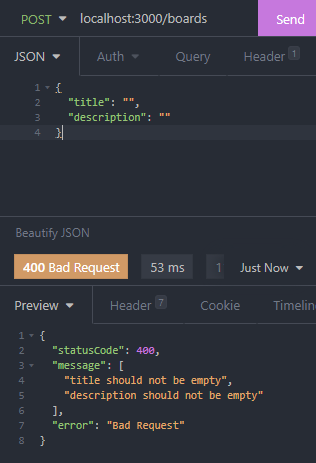
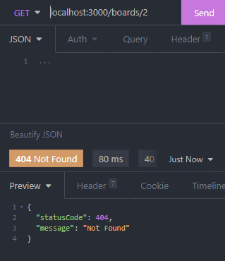
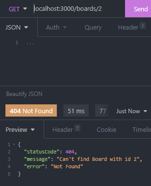
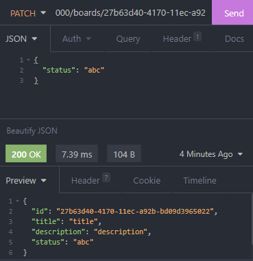

<p align="center">
  <a href="http://nestjs.com/" target="blank"></a>
</p>

[circleci-image]: https://img.shields.io/circleci/build/github/nestjs/nest/master?token=abc123def456
[circleci-url]: https://circleci.com/gh/nestjs/nest


## Description

NestJS 간단한 게시판 CRUD Application

## Installation

```bash
$ npm install
```

## Running the app

```bash
# development
$ npm run start

# watch mode
$ npm run start:dev

# production mode
$ npm run start:prod
```

## What is Controller?

컨트롤러는 들어오는 요청을 처리하고 클라이언트에 응답을 반환합니다.

- 컨트롤러는 `@Controller` 데코레이터로 클래스를 데코레이션하여 정의됩니다.
- 데코레이터는 인자를 Controller에 의해서 처리되는 `경로`로 받습니다.

### Handler

- 핸들러는 `@Get`, `@Post`, `@Delete` 등과 같은 데코레이터로 장식된 컨트롤러 클래스 내의 단순한 메서드입니다.

## What is Providers?

컨트롤러에서 필요한 것들을 넣어주는 종속성 주입의 개념

## What is Service?

컨트롤러에서 데이터의 유효성 체크, DB에 아이템을 생성하는 등의 로직들을 처리합니다.

## DTO를 쓸때 왜 Class를 이용해서 작성하나?

클래스는 인터페이스와 다르게 런타임에서 작동하기 때문에 파이프 같은 기능을 이용할 때 더 유용합니다. 그래서 클래스를 사용해서 DTO를 작성합니다.

## What is Pipe?

Client Request| ➡ | 핸들러 발견 `@GET` | ➡ | Pipe
-|-|-|-|-

클라이언트에서 어떤 데이터를 생성하고자 할때 `Pipe`가 없다면 `Request`는 바로 `Controller`로 전달됩니다.

- `Pipe`는 이 `Request`가 `Controllor`로 전달되기 전에 `Request`에 있는 데이터들의 유효성 검증(Data Validation)을 수행하거나 데이터 변환(Data Transformation)하는 작업들을 할 수 있습니다.

- https://github.com/typestack/class-validator#manual-validation

### What is Data Transformation?

입력 데이터를 원하는 형식으로 변환합니다.

`ex) string '1' => Number 1`

### What is Data validation?

입력 데이터를 평가하고 유효한 경우 변경되지 않은 상태로 전달하면 됩니다. 그렇지 않으면 데이터를 올바르지 않을 때 예외를 발생시킵니다.

`ex) name의 length가 10이하인데 10이상이면 에러 발생`

### How to binding Pips?

`Pipe`는 3가지 방법으로 나뉘어 사용됩니다.
`Handler-level Pipes`, `Parameter-level Pipes`, `Global-level Pipes`

### Handler-level Pipes

핸들러 레벨에서 @UsePipes() 데코레이터를 이용해서 사용 할 수 있으며 모든 파라미터에 적용됩니다.

### Parameter-level Pipes

특정 파라미터에게만 적용되는 Pipe입니다.

### Global-level Pipes

애플리케이션 전체에 적용하는 Pipe이기 때문에 main.ts에서 적용해주시면 됩니다.

- `app.UseGlobalPipes(GlobalPipes)`

### Built-in Pipes

NestJS에서 기본적으로 사용가능한 6가지 Pipe가 있습니다.

- ValidationPipe
- ParseIntPipe
- ParseBoolPipe
- ParseArrayPipe
- PipeUUIDPipe
- DefaultValuePipe

### ValidationPipe + class-validator 적용

```typescript
// dto.ts
import { IsNotEmpty } from 'class-validator';
export class CreateBoardDto {
  @IsNotEmpty()
  title: string;

  @IsNotEmpty()
  description: string;
}

// controller.ts
@Post()
@UsePipes(ValidationPipe)
createBoard(@Body() createBoardDto: CreateBoardDto): Board {
  return this.boardsService.createBoard(createBoardDto);
}
```

### 실제 테스트 결과



### 특정 게시물을 찾을 때 없는 경우 결과 값 처리

- `NotFoundException`라는 예외 인스턴스를 생성해서 이용하시면 됩니다.

```typescript
getBoardById(id: string): Board {
  const found = this.boards.find(board => board.id === id);

  if(!found) {
    throw new NotFoundException();
  }
    return found;
}
```

### 실제 테스트 결과



### 원하는 에러 메시지 표출

```typescript
throw new NotFoundException(`Can't find Board with id ${id}`);
```

### 실제 테스트 결과



## Custom Pipe를 이용한 유효성 체크

- `Pipe Transform`이란 인터페이스를 새롭게 만들어서 구현해야 합니다.
- 이 `Pipe Transform`은 모든 파이프에서 구현해줘야 하는 인터페이스입니다.
- 그리고 이것과 함께 모든 파이프는 `transform()` 메소드가 필요합니다.
- 이 메소드는 NestJS가 인자(arguments)를 처리하기 위해 사용됩니다.

### transform() 메소드

- 이 메소드는 2개의 파라미터를 가집니다.
- 첫번째는 처리가 된 인자의 값(value)
- 두번째는 인자에 대한 메타 데이터를 포함한 객체

- 이 메소드에서 반환된 값은 route 핸들러로 전해집니다.
- 만약 에외(Exception)가 발생하면 클라이언트에 바로 전해집니다.

### 실제 적용후 transform() 메소드의 파라미터 찍어보기

```typescript
// custom pipe.ts
import { ArgumentMetadata, Logger, PipeTransform } from '@nestjs/common';

export class BoardStatusValidationPipe implements PipeTransform {
  transform(value: any, metadata: ArgumentMetadata) {
    Logger.log(value, 'value');
    Logger.log(metadata, 'metadata');

    return value;
  }
}

// controller.ts
@Patch('/:id/status')
updateBoardStatus(
  @Param('id') id: string,
  @Body('status', BoardStatusValidationPipe) status: BoardStatus, // 파라미터 레벨에서 유효성 체크
) {
  return this.boardsService.updateBoardStatus(id, status);
}
```

### Api 호출



### 결과

```bash
[Nest] 24560  - 2021. 11. 10. 오전 12:17:39     LOG [value] abc
[Nest] 24560  - 2021. 11. 10. 오전 12:17:39     LOG [metadata] Object:
{
  "type": "body",
  "data": "status"
}
```
